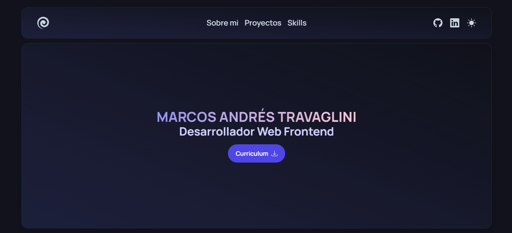

# Portafolio

    </img>

## Tabla de contenido

- [Portafolio](#portafolio)
  - [Tabla de contenido](#tabla-de-contenido)
  - [Descripción](#descripción)
  - [Mi Procedimiento](#mi-procedimiento)
    - [Construido con](#construido-con)
    - [Lo que aprendí](#lo-que-aprendí)
    - [Desarrollo continuo](#desarrollo-continuo)
    - [Recursos útiles](#recursos-útiles)
  - [Autor](#autor)

## Descripción

En está página encontrarás mi portafolio, donde doy una breve descripción sobre mi y muestro mis proyectos mas destacados.

Los usuarios deberían poder:

- Ver el diseño óptimo según el tamaño de la pantalla de su dispositivo
- Ver estados de desplazamiento para elementos interactivos

## Mi Procedimiento

### Construido con

- React
- TypeScript
- Tailwind CSS
- Framer Motion
- React Router

### Lo que aprendí

- Este proyecto lo use para entrar al mundo de Tailwind CSS, un framework que hace mucho tiempo quise probar, pero prefería seguir practicando CSS puro. Además, en este proyecto, también implemento TypeScript como para ir agarrando confianza.

### Desarrollo continuo

En el futuro me gustaría ir agregando otras secciones al portafolio, como la experiencia que voy ganando en el trabajo o nuevas skills que voy aprendiendo.

### Recursos útiles

- [Tailwind CSS](https://tailwindcss.com/) - Documentación.

## Autor

- Github - [Blackpachamame](https://github.com/Blackpachamame)
